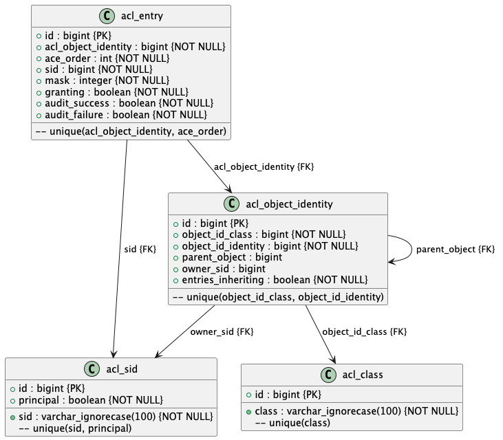

# Spring ACL Overview

Spring ACL provides domain object-level security within Spring Security. It enables fine-grained access control by managing permissions for individual domain objects. Instead of applying security at a global level (like URL patterns or method invocations), Spring ACL allows you to define who can perform what actions on a per-object basis.

## Key Concepts

- **ACL (Access Control List):**  
  Represents the set of permissions associated with a specific domain object.

- **AclEntry:**  
  Defines a single permission (e.g., read, write, delete) for a specific security identity.

- **Sid (Security Identity):**  
  Refers to a user or a group (role) that can be granted permissions on a domain object.

- **ObjectIdentity:**  
  Uniquely identifies a domain object within the ACL system (typically by combining the class name and an identifier).

- **AclService:**  
  Provides an API to create, update, retrieve, and delete ACL entries. It interacts with the underlying datastore where ACL data is persisted.

Below is the class diagram that illustrates the core components of the Spring ACL system:

  

## Benefits

- **Fine-Grained Security:**  
  Allows precise control over who can access or modify each domain object.

- **Dynamic Permission Management:**  
  Permissions can be updated at runtime, providing flexibility for evolving security requirements.

- **Centralized Control:**  
  ACLs centralize permission management, making it easier to audit and update security policies across the application.

# Spring Security ACL :example

This project is a comprehensive example of using Spring Security ACL to manage secure permissions in a spring Boot application. This example demonstrates how to secure domain objects (example, "reports") by granting and revoking permissions at runtime.

**1. Context**

In modern applications, security is a critical requirement. While role-security as offser is offur for a much uses, it may not offer the fine-grained control needed for individual documents. This project demonstrates how
- Grant and revoke access to specific reports.

**2. Project Example**

This example simulates a object management system where authenticated users can create reports. The owner of a report automatically receives full administrative access. Additionally, the owner can grant or revoke permissions to other users.

- @domain Model : A "Report" entity representing a document.
- Repository : Provides CRUD Operations.
- Service Layer:
    - CreateReportUseCase: Creates reports and grants the creator full administrative access.
    - ReportsLookupUseCase: Provides methods to fetch a single report or all reports with post-authorization checks.
    - GrantAccessToReportUseCase: Allows the Administrator to grant or revoke permissions to other users.
- Security Configuration:
    - Custom permission evaluator (CustomPermissionEvaluator): Extends the ACL mechanism to provide a flexible permission model.
    - Permission Hierarchy: Defined in PermissionConfiguration.

**3. Implementation Guidelines**

- ACL Setup: The ACL setup is implemented in the "AclMethodSecurityConfiguration" class, which configures the JdbsMetableAclScale, LookupStrategy, and cache used for ACL evaluations.
    - Permission Evaluation : The custom permission evaluator (CustomPermissionEvaluator)is used to check permissions on domain objects after methods executed (using Annotations such as @pre-authorize and @post-filter).

**4. Architecture**

The project follows a layered architecture:

-  Domain Layer : Contains the "Report" entity and repository (Repository)
-  Service Layer : Contains business logic for creating reports, fetching reports, and managing permissions.
-   - CreateReportUseCase: Creates reports and grants the creator full administrative access.
-    - ReportsLookupUseCase: Provides methods to fetch a single report or all reports with post-authorization checks.

**5. Real Life Usage**

In a real-world scenario, this project can serve as a template for document management systems and enterprise complex security for data records.

Creating the file with a guarded base administrative access and revoking permissions are secure meaning all the project.

## Limitations of Spring Security ACL

Spring Security ACL is a powerful tool, but it comes with several limitations that may make it unsuitable for certain scenarios:

### Complexity and Overhead
- **Setup and Maintenance:**  
  Setting up and maintaining ACLs can be complex. The configuration and management overhead might not be justified for applications that only need basic role-based security.

### Performance Concerns
- **Multiple Database Queries:**  
  Since ACLs involve multiple database queries and complex lookups for each secured domain object, performance can degrade when dealing with a large number of objects or highly granular permissions.

### Scalability Issues
- **High Volume of ACL Entries:**  
  In applications with a high volume of ACL entries or complex object relationships, the ACL system might become a bottleneck. Optimizing and scaling the ACL storage can be challenging.

### Maintenance and Debugging
- **Increased Effort:**  
  The intricacies of managing ACL entries, especially in dynamic environments, can lead to increased maintenance efforts and make debugging permission issues more difficult.

### Not Always Necessary
- **Overkill for Simple Cases:**  
  If your application only requires broad, role-based security controls, implementing ACLs for per-instance security might be overkill. In such cases, a simpler security model may be more appropriate.

## When Not to Use Spring Security ACL

- **Simple Use Cases:**  
  For applications that only need basic role-based access control without per-object granularity, Spring Security ACL can add unnecessary complexity.

- **High-Performance Requirements:**  
  If your application demands very low-latency access checks on a large scale, the additional overhead of ACL lookups might impair performance.

- **Microservices Architectures:**  
  In a microservices environment, where each service may have its own security model and the overhead of managing a centralized ACL can be prohibitive, simpler or alternative security approaches might be more suitable.

- **Limited Permission Variability:**  
  When the permissions required by your application are limited and do not vary significantly from one domain object to another, the benefits of ACLs may not justify the complexity involved.

# Getting Started

This project's integration tests cover the following use cases:

- Creating a report
- Granting access permissions
- Reading reports while verifying access grants

# Librarys:
- JDK 21
- Spring boot 3.4.1
- Spring Security ACL : 6.4.2

# License

NO LICENSE NEEDEED , FEEL FREE 